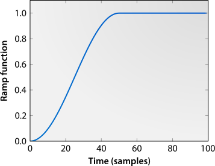

Welcome to liuproto's documentation!
=====================================

This program is motivated by the creation of a digital encryption system for insecure networks which protects users against eavesdroppers with *arbitrary* computing power.

.. toctree::
   :maxdepth: 2

Indices and tables
==================

* :ref:`genindex`
* :ref:`modindex`
* :ref:`search`

User's guide
============

Getting started
---------------

Our implementation of the Liu key agreement protocol is written in Python,
and can be accessed from the command line.
In this tutorial, we describe the use of both modes, communicating over
the network, dumping the results, and comparing them to the those yielded
by software run within a single process.

Three command-line tools are included to access this functionality:

*liuproto_local.py*
    Creates two endpoints and completes the specified exchanges locally.

*liuproto_client.py*
    Creates an endpoint and connects to a server, completing the specified
    exchanges before disconnecting from the server.

*liuproto_server.py*
    Waits for a client to connect, creates an endpoint---based on
    parameters provided by the client---and executes exchanges until
    the client disconnects.

Setting up the environment
^^^^^^^^^^^^^^^^^^^^^^^^^^

Our implementation requires both a Python installation and the Numpy
python module.  For those who do not wish to install these themselves,
we have included a Vagrant_ configuration that will automatically configure
a virtual machine.

In order to use this facility, install Vagrant_, Virtualbox_, and an SSH
client---that provided with Git will suffice---and then run the
command "*vagrant up*" from the *liucipher/*
directory.  Vagrant will then download a virtual machine image and install
the necessary software.

Making sure that the *ssh* command is available from your shell, run the
command *vagrant ssh*.  This will provide you with a shell within the
virtual machine.  The project root directory is shared with the
virtual machine as */vagrant/*.

.. _Vagrant: https://www.vagrantup.com/
.. _Virtualbox: http://www.virtualbox.org/

Communicating over the network
^^^^^^^^^^^^^^^^^^^^^^^^^^^^^^

We begin by starting the server, using *liuproto_server.py*:

.. code-block:: console

    vagrant@vagrant-ubuntu-trusty-64:/vagrant/src$ python liuproto_server.py -l 127.0.0.1 -p 8888

The server will begin listening for connections from the local machine
on port 8888.  The client is contained within *liuproto_client.py*, and
we run it with the default parameters with 100 repetitions:

.. code-block:: console

    vagrant@vagrant-ubuntu-trusty-64:/vagrant/src$ python liuproto_client.py -a 127.0.0.1 -p 8888 -r 100
    011111001111100101101111011010111

The client emits each of the bits agreed on, as will the server:

.. code-block:: console

    vagrant@vagrant-ubuntu-trusty-64:/vagrant/src$ python liuproto_server.py -l 127.0.0.1 -p 8888
    111110101011100111101111011010111

It is important to note that these bits will not necessarily be identical;
there is a finite error rate which can be reduced by adjustment of the
parameters.  For example, with a larger number of exchanges per
protocol iteration:

.. code-block:: console

    vagrant@vagrant-ubuntu-trusty-64:/vagrant/src$ python liuproto_server.py -l 127.0.0.1 -p 8888
    010001100000011011000110000000010001101010111111110001111110

.. code-block:: console

    vagrant@vagrant-ubuntu-trusty-64:/vagrant/src$ python liuproto_client.py -a 127.0.0.1 -p 8888 -r 100 -n 100
    010001100000011011000110000000010001101010111111110001111110

In this case there are no errors, as the extra exchanges serve to reduce
the probability that the cross-correlation process (described later) will
incorrectly identify the randomly-chosen parameter; this comes at the cost
of performance, as each bit now requires the sending of 201 messages.

We can produce more detailed output by providing the *-x* option to these
programs, causing them to emit an XML document that contains the complete
state of their endpoint or endpoints, the messages emitted, and the bit
emitted:

.. code-block:: xml

    vagrant@vagrant-ubuntu-trusty-64:/vagrant/src$ python liuproto_client.py -a 127.0.0.1 -p 8889 -r 1 -n 5 -x
    <?xml version='1.0'?>

    <session link='client' xmlns='http://www.noosphere.org/liuproto'>
            <run id="0">
                    <endpoint
                        id="Alice"
                        reflection_coefficient="-0.500000"
                        cutoff="0.500000"
                        ramp_time="1">
                            0.902397409878 -0.597093943732 1.85275640696 -0.452991413682 0.335067651819 -0.601199733991
                    </endpoint>

                    <message from="Alice" to="Bob">0.902397</message>
                    <message from="Bob" to="Alice">0.455416</message>
                    <message from="Alice" to="Bob">-0.824802</message>
                    <message from="Bob" to="Alice">0.814824</message>
                    <message from="Alice" to="Bob">1.852756</message>
                    <message from="Bob" to="Alice">0.504530</message>
                    <message from="Alice" to="Bob">-0.705257</message>
                    <message from="Bob" to="Alice">1.363218</message>
                    <message from="Alice" to="Bob">0.335068</message>
                    <message from="Bob" to="Alice">0.531468</message>
                    <message from="Alice" to="Bob">-0.866934</message>

                    <result endpoint="Alice" />
            </run>
    </session>

This document includes sufficient information to reconstruct the
decision-making process of Alice.  We will now run the client and server
programs once more, saving their XML output to the filesystem.

.. code-block:: console

    vagrant@vagrant-ubuntu-trusty-64:/vagrant/src$ python liuproto_server.py -l 127.0.0.1 -p 8888 -x > /home/vagrant/server.xml

.. code-block:: console

    vagrant@vagrant-ubuntu-trusty-64:/vagrant/src$ python liuproto_client.py -a 127.0.0.1 -p 8888 -r 1000 -n 10 -x > /home/vagrant/client.xml

Reading XML output files
^^^^^^^^^^^^^^^^^^^^^^^^

Having done this, we may open a Python shell and read in the XML files::

    >>> import liuproto.storage
    >>> session_server = liuproto.storage.Session.from_file('/home/vagrant/server.xml')
    >>> session_client = liuproto.storage.Session.from_file('/home/vagrant/client.xml')
    >>> print len(session_client.runs)
    1000

The *Session* objects contain an array of *Run* objects, one for each
repetition of the protocol.  Each *Run* contains an array of *Result* objects,
which we can use to estimate the bit error rate::

    >>> bits_alice = [run.results[0].result for run in session_client.runs]
    >>> bits_bob = [run.results[0].result for run in session_server.runs]
    >>> bits_emitted = [x for x in bits_alice if x is not None]
    >>> bits_error = [i for i in range(len(bits_alice)) if bits_alice[i] != bits_bob[i]]
    >>> float(len(bits_error))/len(bits_emitted)
    0.02097902097902098

We can also determine the efficiency of the protocol, the proportion of runs
that end with a bit being emitted::

    >>> float(len(bits_emitted))/len(bits_alice)
    0.429

An introduction to the Liu key agreement protocol
-------------------------------------------------

The Liu protocol is a protocol for key agreement over a classical channel.
Related to the Kish Key Distribution scheme, it functions by transmitting
a random signal which is mixed with a scaled copy of the received signal.
By randomly selecting the sign of the scaling factor, a random key can
be generated.

The messages travelling back and forth are given by

.. math::
    M[2k] &= Z_a[k] + \beta[2k] M[2k-1] \\
    M[2k+1] &= Z_b[k] + \alpha[2k+1] M[2k] ,

from Alice to Bob and vice-versa respectively.  By cross-correlating
message from Bob and Alice with
with :math:`Z_a` and :math:`Z_b` respectively, Alice and Bob may determine the
respective values of :math:`\beta` and :math:`\alpha`.

In particular, the estimated signs :math:`\hat{A}` and :math:`\hat{B}` are

.. math::
    \hat{A} &=
        \begin{cases}
            -1, &\left<Z_b, M_{a\rightarrow b} \right> < 0\\
             +1, & \text{otherwise}
        \end{cases} \\
    \hat{B} &=
        \begin{cases}
            -1, &\left<Z_a, M_{b\rightarrow a} \right> < 0\\
             +1, & \text{otherwise},
        \end{cases}

where :math:`\left<\cdot\right>` denotes the time-averaging operator.

Transient attack countermeasures
^^^^^^^^^^^^^^^^^^^^^^^^^^^^^^^^

However, this system is vulnerable to attack due to start-up transients;
it takes some time to reach steady-state.  In order to combat this,
we slowly increase the reflection coefficient magnitude from zero
to its final value; the increase takes the form of a raised sine
profile starting at zero and smoothly increasing to one at time :math:`T_R`:

.. math::
    \gamma[k] &=
        \begin{cases}
            \frac{1}{2} \left[ 1 + \sin(t-T_R/2) \cdot \pi/T_R \right], & 0 \le t < T_R \\
            1, & t > T_R
        \end{cases} .

We use this to scale the reflection coefficients, yielding

.. math::
    \alpha[n] &= \alpha \gamma[n] \\
    \beta[n] &= \beta \gamma[n] .

Quantisation of the messages is believed by [XXX] to further hamper
transient attacks by eavesdroppers.

Random number generation
^^^^^^^^^^^^^^^^^^^^^^^^

We next consider random number generation.  In a practical system, it would
be necessary to use a true random number generator, however for our purposes
a pseudo-random number generator is sufficient.  We begin by generating two
band-limited source processes :math:`U_1` and :math:`U_2`.  The band-limiting
is performed in the frequency domain by computing the fast Fourier transform,
zeroing the unwanted frequency components, and computing the inverse
fast Fourier transform.  These two processes are then combined according
to the value of the ramping function :math:`\gamma[n]`, yielding

.. math::
    Z[n] = U_1[n]\sqrt{1-\gamma^2[n]} + U_2[n] \gamma[n] .

The coefficients are chosen in order to produce a process of constant
variance.

Modules
=======

liuproto.endpoint
-----------------

.. automodule:: liuproto.endpoint

liuproto.link
-------------

.. automodule:: liuproto.link

